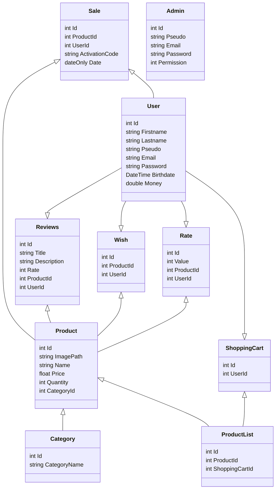

# To start the project
1. Git clone this repository
2. Start the Back-End project with the command ``` dotnet run --project .\e-commerce\ ```
3. Start the Angular server with this command
   ``` cd .\front\src\app\ |  ng serve --o ```. <br>If you are already in the app folder, just type ``` ng serve --o ```

## Back-End
 &nbsp; 

- E-commerce for API (Controllers)
- E-commerce.Business for Business Layer (Services)
- E-commerce.Data for Data Layer (Repositories)

<br>

## Front-End
 &nbsp; 
 &nbsp;   &nbsp; 

- Angular using Typescript to create Module, Services and Components
- Customize Components Templates with HTML & SCSS
  
<br>

---

<br>

### Modèle de données :

