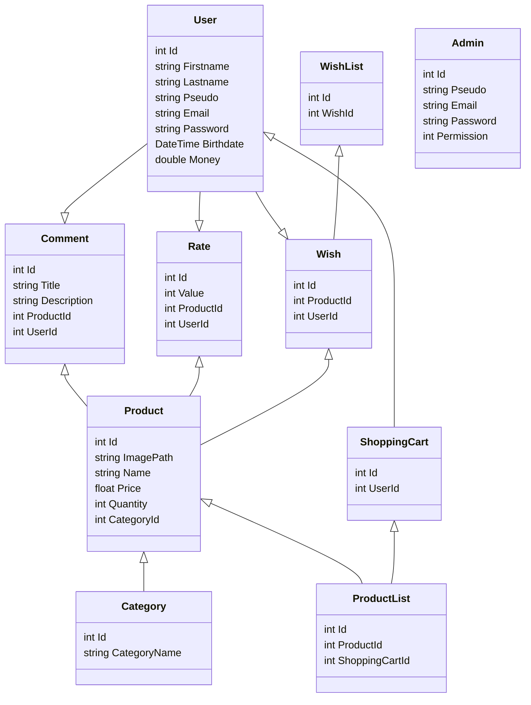

## Back-End
 &nbsp; Manipulate our database 

 

## Front-End
 &nbsp; Get the data from our database and show it to the user  
 &nbsp; Giving some style to our front

 

---

 

### Few [Gitmoji](https://gitmoji.dev) for understand our conventionnal commit
**:construction:**  -  *'Work in progress.'* 
**:card_file_box:**  -  *'Perform database related changes.'* 
**:memo:** -  *'Add or update documentation.'*

### Modèle de données :
